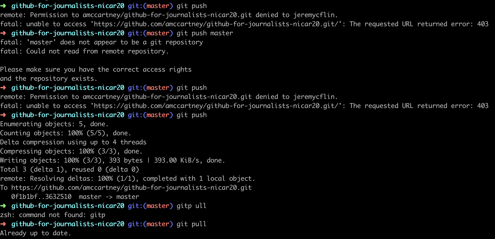
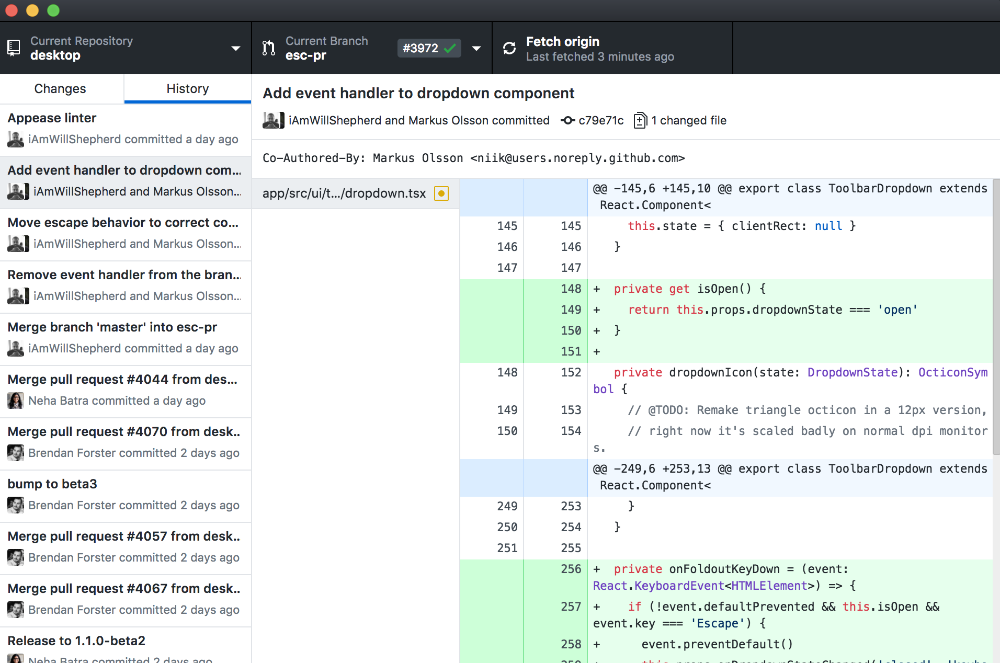

# Github for Journalists
## NICAR 2020

Allison McCartney | Bloomberg Graphics space mom

@anmccartney
Jeremy C.F. Lin | Bloomberg Graphics chaos prince 

@Jeremy_CF_Lin 

Welcome to Github for Journalists!

## What is Github? What is git?

Git is a version-control system for tracking changes in source code during software development. Whenever you make changes to a file that is tracked by git, both the old and new versions of that file are preserved in case you need to refer or revert to an earlier version. 

Github is a website built on top of git that allows for easier access and sharing of repositories for people on teams or to the wider public.

You can think of Github like a Google Doc where you can write/edit with your team simultaneously, view edit history and revert back, make a copy of the document and work on your own version or set the document private. It makes collaboration easier and more efficient. 

## Why should I use it?

Github allows you to track changes you make to your files, which can be useful when you are writing code, but also for many other applications. Github is particularly useful when you have more than one person working on the same project at once, and need to keep track of who is doing what work and where. 

Github also supports project organization tools like "tickets" and "milestones" where you can assign certain tasks to team members, and check them off as they are accomplished.

Github also natively supports display for several types of files like Markdown, which this page is written in. It can also display Jupyter notebooks, CSV files, images in the browser, making it easy to share work. 

## The ways you can use Github

### The browser
You can make changes to a Github project right in the browser if you want to. This is useful for making simple copy changes when you don't want to download the project to the computer. 

### The terminal
Most people who use Github for storing code projects interact with Github primarily through the command line, or terminal. This is the quickest way to manage your git projects, but also requires a working knowledge of git and other shell commands. 

If you are not familiar with these, do not be intimidated! We will not be focused on this during today's session, but it doesn't take too much time to get familiar with the flow of commands.

[Online tutorial using command line](http://rogerdudler.github.io/git-guide/)

### The desktop app
The desktop app is the most user-friendly way to connect your local computer to your Github repositories. Most beginners start here. It provides a visual interface for uploading and downloading files to and from your remote repositore (on github.com), and tracking those changes. This is what we'll be working in today.

## Using the Github desktop app

TKTK put in slides/images etc. here TKTK
SCREEN SHOTS TO COME

## Creating a new repository

1. Go to `github.com` and log in
2. Once logged in, a big plus sign should appear on the upper right corner of your screen next to your avatar. Click it, and choose `New Repository`
3. TKTKTK

## Basic commands

* `git clone`
* `git status`
* `git add`
* `git commit`
* `git push`
* `git pull`
* `.gitignore` files

## Terms explaiend

* `master`: Main branch of your repository, the default branch if you dont create others.
* `branch`: Use a branch to isolate development work without affecting other branches, basically means you are creating a new version of the repository. 
* `fork`: A fork is a copy of a repository. Forking a repository allows you to freely experiment with changes without affecting the original project.
* `pull request:` Pull requests let you tell others about changes you've pushed to a repository and the receivers can then decide whether to merge your changes. 
* `merge conflict`: Conflicts happen when the same lines in a file eidted by two people, or if one developer deleted a file while another developer was modifying it. In these cases, Git cannot automatically determine what is correct. 

## Create a personal Github page?

Github pages allow users to create a simple static site that's hosted right here on github.com. That way you don't have to deal with servers and such. You can also make a Github page for your projects, just like the one you are reading right now. They come with a variety of standard themes, or you can create your own.

If you are interested in creating a personal, organizational, or project page, check out this [handy guide](https://pages.github.com/).

## Scary Github warnings!!!

# 🚨🚨🚨🚨🚨🚨🚨🚨🚨🚨🚨🚨
# Do not put passwords or other sensitive information in files you commit to Github!!! 

People will find them, and will make your life or your organization's existence miserable!

Remember too that Github preserves all versions of your code, so even past versions of your code can make you vulnerable.

Make sure to put any sensitive passwords or keys in a passwords file, and list it under gitignore so it won't be committed to your repository.

## Oh no! I messed up everything and now my world is crashing down but Liam Neeson won't come to rescure. WHAT DO I DO?

Take a breath, meditate and then delete your folder and reclone. It works and it's glorious. Everybody should try it. 

